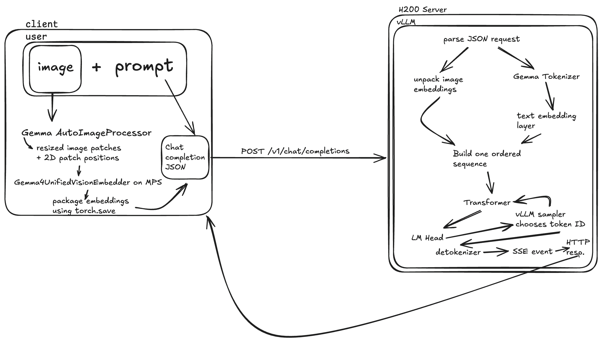

# Cross-Device Gemma 4

The Mac processes the raw image and produces visual vectors. The H200 tokenizes the prompt, combines the resulting text vectors with the visual vectors, and generates the answer. The Mac sends the prompt as text and a packaged visual tensor as a base64 string inside a JSON request.

## Separating the Model

The original `google/gemma-4-12b-it` model contains:

- Visual components for processing images.
- Language components for understanding inputs and generating text.

[`src/cross_device_gemma/export_split.py`](src/cross_device_gemma/export_split.py) loads the original model and creates two directories:

```text
artifacts/gemma-4-12b/client
artifacts/gemma-4-12b/server
```

## Client Artifact

The client artifact contains:

- Image-processor configuration.
- Vision-model configuration.
- Gemma vision-embedder weights in `vision.safetensors`.

[`minimal/client.py`](minimal/client.py) loads this artifact and runs the vision embedder on the Mac using Apple MPS.

## Server Artifact

The server artifact contains:

- Gemma tokenizer.
- Text-embedding weights.
- Language-transformer weights.
- LM-head weights.

[`minimal/server.py`](minimal/server.py) loads the server artifact directly with Hugging Face Transformers (this version can run without vLLM, but is much slower):

```bash
python -m minimal.server \
  --server-artifact artifacts/gemma-4-12b/server
```

## How to Run

On the H200:

```bash
python -m minimal.server \
  --server-artifact artifacts/gemma-4-12b/server \
  --host 127.0.0.1 \
  --port 8000
```

The server:

- Loads the encoderless Gemma artifact onto CUDA.
- Loads the Gemma tokenizer.
- Opens `/v1/chat/completions`.
- Waits for requests from the Mac.

On the Mac, open an SSH tunnel:

```bash
ssh -N \
  -L 8000:127.0.0.1:8000 \
  <user>@<h200-host>
```

This makes the H200 server available to the Mac at:

```text
http://127.0.0.1:8000
```

In another Mac terminal:

```bash
python -m minimal.client \
  --artifact artifacts/gemma-4-12b/client \
  --server http://127.0.0.1:8000 \
  --image /path/to/image.png \
  --question "What is shown in this image?"
```

## Optimized Version

The optimized version uses the same split artifacts, however it has an additional server artifact for vLLM. That artifact is configured to load the custom encoderless Gemma.

```bash
pip install vllm
pip install -e optimized
```

The plugin is defined in [`optimized/optimized_vllm/model.py`](optimized/optimized_vllm/model.py).

This allows vLLM to:

- Accept visual vectors instead of a raw image.
- Skip constructing Gemma's vision encoder.
- Insert the received visual vectors into the language sequence.

The custom vLLM artifact is needed because the normal encoderless server artifact does not tell vLLM how to accept visual vectors produced on the Mac. Its modified `config.json` directs vLLM to load our custom adapter in [`optimized/optimized_vllm/model.py`](optimized/optimized_vllm/model.py), which recognizes `image_embeds` in the request, reconstructs the visual tensor, reserves the corresponding positions in Gemma's input sequence, places the visual vectors into those positions, and runs the language model without creating a vision encoder.

## Using the Optimized Version

On the H200:

```bash
python optimized/prepare_artifact.py \
  --client artifacts/gemma-4-12b/client \
  --server artifacts/gemma-4-12b/server \
  --output artifacts/gemma-4-12b-vllm
```

Start vLLM on the H200:

```bash
./optimized/serve.sh \
  artifacts/gemma-4-12b-vllm
```

On the Mac, open an SSH tunnel:

```bash
ssh -N \
  -L 8001:127.0.0.1:8001 \
  <user>@<h200-host>
```

In another Mac terminal, run the optimized client:

```bash
python optimized/client.py \
  --artifact artifacts/gemma-4-12b/client \
  --server http://127.0.0.1:8001 \
  --image /path/to/image.png \
  --question "What is shown in this image?"
```

Alternatively, start the browser frontend:

```bash
python optimized/frontend.py \
  --artifact artifacts/gemma-4-12b/client \
  --server http://127.0.0.1:8001 \
  --port 3001
```

Open [http://127.0.0.1:3001](http://127.0.0.1:3001).

## Bit-Identical Binary Transport

[`optimized_v2/`](optimized_v2/README.md) keeps the visual tensor in BF16 without quantization and sends its raw bytes over the Mac-to-H200 connection. An H200 gateway reconstructs the exact tensor, translates it to vLLM's existing `image_embeds` format over loopback, and relays the SSE response over a persistent HTTP connection.

For a `[264, 3840]` BF16 tensor, the binary request is approximately `2.03 MB` instead of `2.70 MB` for the base64 tensor representation. Run the bit-identity proof with:

```bash
python -m optimized_v2.prove
```

See the [optimized v2 run guide](optimized_v2/README.md) for the gateway, tunnel, client, and frontend commands.

## High-Level Overview of the Optimized Architecture


